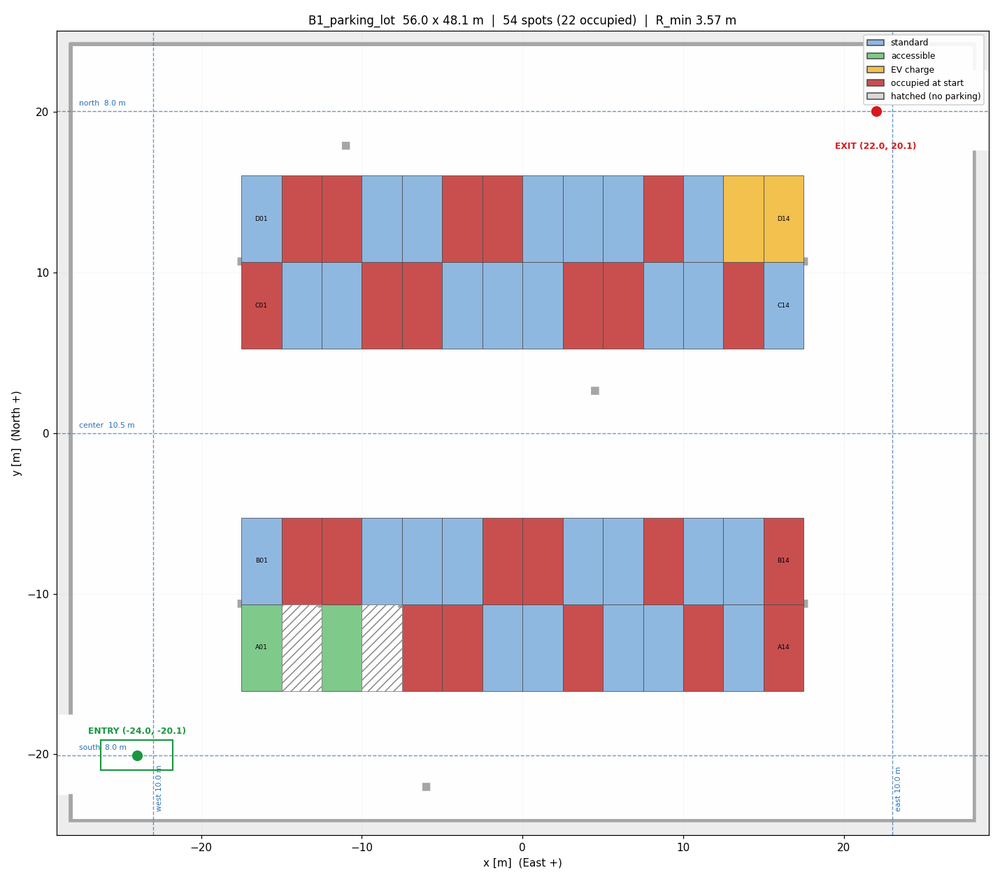

# parking_lot_world

차량형(Ackermann) 로봇 **자율 발렛파킹** 프로젝트용 주차장 시뮬레이션 맵 패키지.

대상 환경: **Ubuntu 24.04 / ROS 2 Jazzy / Gazebo Harmonic (gz-sim 8) / Nav2 1.3+**

> 계획서에는 ROS 2 Humble 로 적혀 있으나 Humble 은 Ubuntu 22.04 전용이다.
> 24.04 VM 을 쓰기로 했으므로 이 패키지는 **Jazzy + Gazebo Harmonic** 기준이다.
> 계획서 기술스택 표기도 `ROS2 Jazzy / Gazebo Harmonic` 으로 수정할 것.

---



*초록=빈 면, 빨강=초기 점유, 파랑=장애인, 청록=EV, 빗금=안전지대, 회색 사각=구조 기둥.
검은 화살표 = 주차 완료 시 앞머리 방향(= 전진 출차 방향), 주황 선 = 후진 진입 경로.
왼쪽 아래 = 입구, 오른쪽 위 = 출구.*

## 1. 주차장 사양

| 항목 | 값 |
|---|---|
| 내부 크기 | 50.00 m (X) × 43.60 m (Y) |
| 주차면 | 56 면 — 주차가능 **54**, 빗금 안전지대 2 |
| 초기 점유 | 22 면 (결정론적 배치 → 데모 재현성) |
| 주차면 규격 | 2.50 m × 5.40 m |
| 통로 | 남/북 외곽 7.00 m, 중앙 8.00 m, 동/서 연결차로 7.00 m |
| 구조 기둥 | 0.5 m 각, 16 개 (A/B, C/D 열 경계선 위, 2면마다) |
| 입구 | 서벽 개구부 5.0 m, 중심 y = −18.30 |
| 출구 | 동벽 개구부 5.0 m, 중심 y = +18.30 |
| 맵 그리드 | 1040 × 912 px @ 0.05 m/px, origin (−26.00, −22.80) |

### 열(Row) 배치 — 남에서 북으로

```
  y=+21.80 ┌──────────────── 북 벽 ─────────────────┐ ── 출구(동벽 y=+18.3)
           │        Aisle_N  (7.0 m)                │
  y=+14.80 ├────────────────────────────────────────┤
           │  Row D  D01..D14   진입:북  (D13/D14 EV)│
  y= +9.40 ├──── ■ 기둥 라인 (2면마다) ──────────────┤
           │  Row C  C01..C14   진입:남              │
  y= +4.00 ├────────────────────────────────────────┤
           │        Aisle_C  (8.0 m)  ← 회전 여유    │
  y= -4.00 ├────────────────────────────────────────┤
           │  Row B  B01..B14   진입:북              │
  y= -9.40 ├──── ■ 기둥 라인 (2면마다) ──────────────┤
           │  Row A  A01..A14   진입:남              │
           │         A01/A03 장애인, A02/A04 빗금    │
  y=-14.80 ├────────────────────────────────────────┤
           │        Aisle_S  (7.0 m)                │
  y=-21.80 └──────────────── 남 벽 ─────────────────┘
 입구(서벽 y=-18.3)
       x=-25.00        주차면 블록 x∈[-17.5,+17.5]        x=+25.00
```

* 좌표계: `map` 프레임, 원점 = 주차장 중심, X = 동, Y = 북, yaw = ENU 반시계
* 주차면 ID = `<열문자><2자리>`, 서→동 순 (`A01` … `D14`)
* **진입:남** = 남쪽 통로에서 후진 진입 → 주차 후 앞머리가 **남쪽(통로)** 을 향함
* **진입:북** = 그 반대. 어느 쪽이든 **출차는 항상 전진** (계획서 `UnparkManeuver` 요구사항)

---

## 2. 산출 파일

```
parking_lot_world/
├── tools/generate_parking_lot.py    ★ 단일 소스. 아래 전부를 여기서 생성
├── worlds/parking_lot.sdf            Gazebo Harmonic 월드 (140 KB)
├── models/parked_car/                런타임 스폰용 정적 차량
├── maps/
│   ├── parking_lot.{pgm,yaml}        Nav2 정적 맵 — 벽/기둥/충전기/라바콘만
│   ├── parking_lot_occupied.*        참고용 (초기 주차차량까지 포함)
│   ├── keepout_mask.*                주차면 내부 진입금지 (Keepout Filter)
│   └── speed_mask.*                  주차면 앞 30% / 게이트·코너 50% 감속
├── config/
│   ├── parking_spots.yaml            주차면 관리 노드 ROS2 파라미터
│   ├── parking_spots.json            관제 대시보드(팀원 B)용 동일 데이터
│   ├── nav2_ackermann.yaml           Smac Hybrid-A* + MPPI 튜닝값
│   └── costmap_filters.yaml          필터 서버 파라미터
└── launch/
    ├── parking_world.launch.py       Gazebo 월드 + /clock 브리지
    └── nav2_valet.launch.py          맵서버 + AMCL + Nav2 스택
```

**정적 맵에 주차 차량을 넣지 않은 이유**: 빈 주차면 탐색이 의미를 가지려면 주차 차량은
라이다로 감지되는 **동적 장애물**이어야 한다. `parking_lot.pgm` 은 인프라(벽·기둥)만
담고, 주차 차량은 Gazebo 월드에 실물로 배치해 `obstacle_layer` 가 잡도록 했다.

---

## 3. 주차면 데이터 구조

`config/parking_spots.yaml` 의 각 주차면은 **후진 주차 기동에 필요한 3개 포즈**를 갖는다.

```yaml
C07:
  row: "C"
  type: "standard"
  entry_side: "S"
  center: [-1.250, 6.700]
  goal_pose:    [-1.250,  6.700, -1.5708]  # ① 최종 주차 포즈 (앞머리 = 통로 방향)
  prepark_pose: [-1.250,  1.700, -1.5708]  # ② 후진 시작 대기 포즈 (통로 위)
  aisle_point:  [-1.250,  0.000]           # ③ 통로 중심선 경유점
  initially_occupied: false
```

### `ParkManeuver` BT 노드가 쓰는 순서

```
③ aisle_point  ──NavigateToPose──▶  ② prepark_pose  ──NavigateToPose──▶  ① goal_pose
   통로 주행(전진)                     90° 선회 + 정렬                    직선 후진 5.0 m
   general_goal_checker              general_goal_checker              parking_goal_checker
   (xy 0.35 / yaw 0.20)                                                 (xy 0.12 / yaw 0.06)
```

`prepark_pose` 는 `goal_pose` 와 **X 좌표가 동일**하고 통로 쪽으로 정확히 5.0 m 떨어져
있으며 **같은 yaw** 를 갖는다. 즉 마지막 구간은 순수 직선 후진이라 후진 추종이 안정적이다.
(계획서 리스크 대응 — "주차면 앞 대기 지점을 경유 waypoint 로 고정해 후진 구간을 짧고 단순하게 유지")

`UnparkManeuver` 는 `goal_pose → prepark_pose → aisle_point` 를 **전진**으로 되짚는다.

---

## 4. 로봇 스펙 전제

이 맵은 아래 제원의 로봇을 기준으로 치수가 잡혀 있다. URDF 설계 시 맞출 것.

| 항목 | 값 |
|---|---|
| 전장 × 전폭 | 4.50 m × 1.90 m |
| 축거(wheelbase) | 2.50 m |
| 최대 조향각 | 35° |
| **최소 회전반경** | **3.57 m** ( = 2.50 / tan 35° ) |
| 통로 주행 속도 | 1.60 m/s |
| 후진 속도 | 0.60 m/s |

검증 완료 사항 (`tools/` 의 기하 체크):
- 54개 전 주차면에서 로봇 풋프린트가 주차면 안에 들어가고 기둥과 간섭 없음
- `prepark_pose` 에서 차체가 통로 밖으로 나가지 않음 (남/북 통로 7.0 m 에 4.5 m 차체 + 여유 2.5 m)
- `goal_pose` 풋프린트 9점이 전부 정적 맵상 free 셀

> **로봇 최소 회전반경이 3.57 m 보다 크게 나오면** `tools/generate_parking_lot.py` 의
> `AISLE_SIDE` / `AISLE_CENTER` 를 8~9 m 로 올리고 재생성할 것. 한 줄만 바꾸면 월드·맵·
> 주차면 테이블·Nav2 파라미터가 전부 일관되게 다시 나온다.

### 스케일 축소

소형 실습 로봇(전장 1 m 급)을 쓸 경우 생성기 상단의 `SCALE = 1.0` 을 `0.4` 로 바꾸고
재생성하면 주차장·차량·맵 해상도가 전부 비례 축소된다.

---

## 5. 실행

```bash
cd ~/valet_parking_ws
colcon build --packages-select parking_lot_world
source install/setup.bash

# 터미널 1 — Gazebo 월드
ros2 launch parking_lot_world parking_world.launch.py

# 터미널 2 — 로봇 스폰 (팀원 A 의 로봇 패키지에서)
#   시작 포즈: x=-23.00  y=-18.30  yaw=0  (입구 진입 직후)

# 터미널 3 — Nav2
ros2 launch parking_lot_world nav2_valet.launch.py

# 터미널 4 — RViz
rviz2 -d $(ros2 pkg prefix parking_lot_world)/share/parking_lot_world/rviz/valet.rviz
```

### 코스트맵 필터 사용 (선택)

```bash
ros2 launch parking_lot_world nav2_valet.launch.py use_costmap_filters:=true
```

기본값은 **꺼짐**이다. keepout 필터를 켜면 주차면 내부가 진입금지가 되어 통로 주행 중
플래너가 주차면을 가로지르지 않지만, **주차 자체도 막히므로** `ParkManeuver` 진입 직전에
런타임으로 꺼야 한다:

```bash
ros2 param set /global_costmap/global_costmap keepout_filter.enabled false   # 주차 시작
ros2 param set /global_costmap/global_costmap keepout_filter.enabled true    # 출차 완료 후
```

이 토글을 `ParkManeuver` / `UnparkManeuver` BT 노드 안에 넣는 것이 "Nav2 심화 구성"
포트폴리오 포인트가 된다.

---

## 6. Nav2 핵심 설정 근거

| 파라미터 | 값 | 근거 |
|---|---|---|
| `motion_model_for_search` | `REEDS_SHEPP` | 후진 포함 motion primitive. `DUBIN` 은 전진만이라 후진 주차 불가 |
| `minimum_turning_radius` | 3.57 | 로봇 기구학 제약. 이 값보다 급한 경로를 아예 생성하지 않음 |
| `reverse_penalty` | 2.1 | 통로에서는 전진 선호. 주차 프로파일에서는 1.3 으로 낮춰 후진 적극 사용 |
| `motion_model` (MPPI) | `Ackermann` + `min_turning_r` | 컨트롤러 단에서도 동일 제약 적용 |
| `vx_min` | −0.60 | **음수여야 후진 추종이 된다.** 0 이면 주차 불가 |
| `PathAngleCritic.mode` | 2 | 전/후진 양방향 허용 |
| `PreferForwardCritic.cost_weight` | 5.0 | 통로용. 주차 구간에서는 0~1 로 낮춘 프로파일 사용 |
| footprint | 직사각 4.6 × 2.0 | 차량형이라 원형 근사 금지. 기둥 사이 통과 판정에 필수 |
| `behavior_plugins` | Spin 제외 | Ackermann 은 제자리 회전 불가 — 복구행동에서 반드시 뺄 것 |
| goal checker 2종 | 통로 0.35 / 주차 0.12 | 계획서 5주차 "허용오차 프로파일 분리" 항목 |

---

## 7. 관제 대시보드 연동 (팀원 B)

`config/parking_spots.json` 을 그대로 프런트엔드에서 fetch 하면 주차장 평면도를 그릴 수 있다.

```js
// 각 주차면: rect = [x0, y0, x1, y1] (map 프레임, m)
// SVG 로 그릴 때 Y 축만 뒤집으면 됨
const { bounds, spots, pillars, hatched_zones } = await (await fetch('/parking_spots.json')).json()
```

포함 필드: `bounds`, `map`(해상도·origin·픽셀크기 → 로봇 위치 오버레이용),
`aisles`, `robot_spec`, `spots[]`, `hatched_zones[]`, `pillars[]`.

실시간 점유 상태는 주차면 관리 노드가 rosbridge 로 발행하는 토픽에서 받고,
이 JSON 은 **정적 레이아웃**만 담당한다.

---

## 7.5 변경 이력 (valet_robot 연동 중 실측으로 수정)

| 항목 | 이전 | 이후 | 이유 |
|---|---|---|---|
| `max_step_size` | 0.001 | **0.004** | RTF 0.088 → 0.54. 913 kg 차량에 1 ms 는 과함 |
| `parking_world.launch.py` | `IfCondition(['not ', gui])` | `UnlessCondition(gui)` | Jazzy 에서 `invalid condition expression` 로 `gui:=false` 가 안 뜸 |

월드에 **렌더링 센서(카메라/라이다)를 추가하지 말 것.** gz-sim 이 이 GL 스택에서
gpu_lidar 를 하나만 렌더링해서, 월드에 센서를 두면 스폰된 로봇의 라이다가 죽는다.
(실측: 더미 센서 있음 0% / 없음 32%)

## 8. 맵 재생성

기하를 바꾸려면 **반드시** `tools/generate_parking_lot.py` 를 수정하고 재생성한다.
`worlds/`, `maps/`, `config/` 는 전부 자동 생성물이므로 직접 수정하면 다음 생성 때 덮어써진다.

```bash
python3 tools/generate_parking_lot.py .
```
